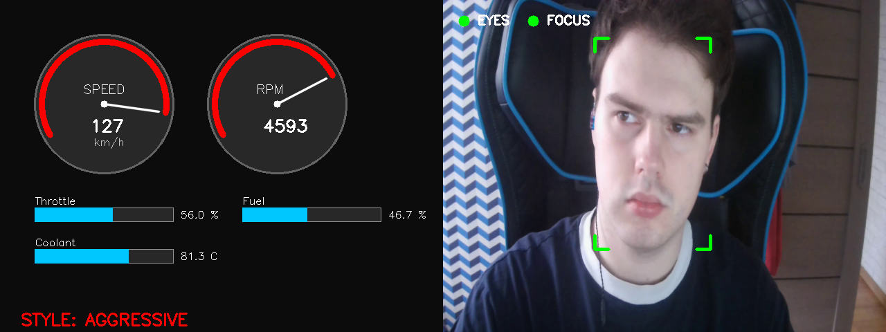
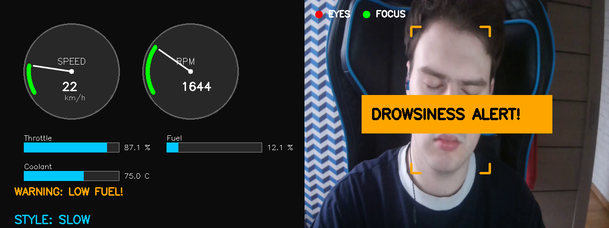
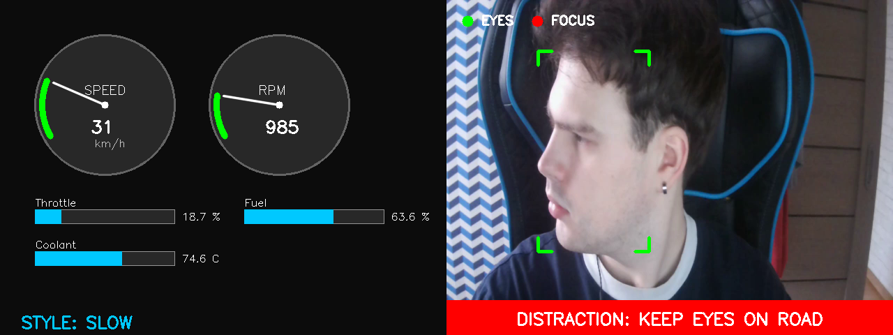

# ADAS Monitor & Face Monitoring

Система мониторинга автомобиля, отображающая телеметрию из датасета OBD-II и анализирующая состояние водителя через веб-камеру.

## Стек технологий
| Технология | Назначение |
| --- | --- |
| C++17 | Основной язык разработки |
| CMake | Система сборки |
| OpenCV 4.x | Рисование интерфейса, захват камеры, работа с DNN |
| ONNX Runtime | Запуск нейросети для классификации стиля вождения |
| Google Test | Модульное тестирование (Unit Tests) |

# Для запуска программы
**1)** Разархивировать ZIP файл "Основные файлы" на диск C
**2)** Открыть командную строку и спуститься в том C (cd..)
**3)** Вписать - "cd C:\real-car-adas-monitor"
**4)** Вписать - ".\build\Release\RealCarMonitor.exe"
Управление: Q - Выход, SPACE - Пауза, S - Скриншот.

# Cкриншот работающей системы

